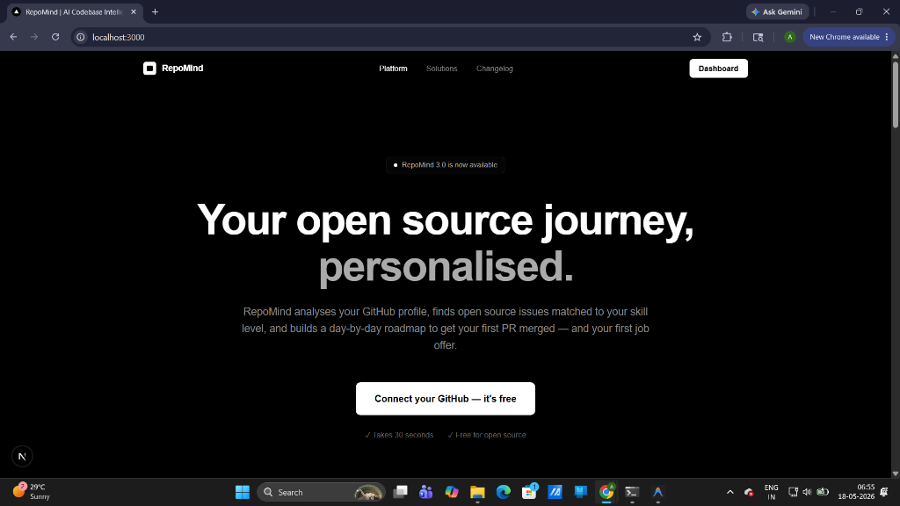
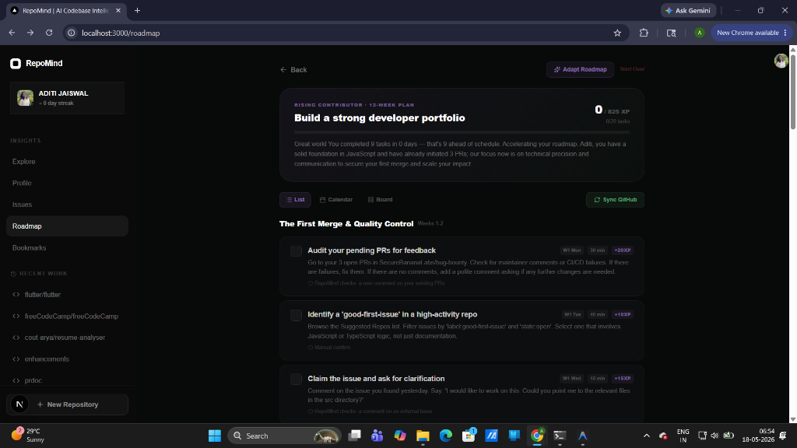
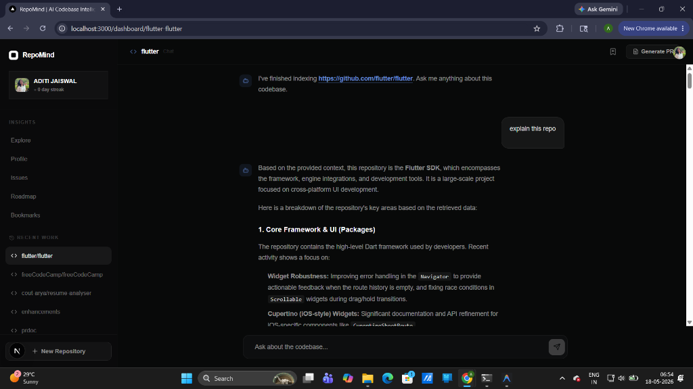
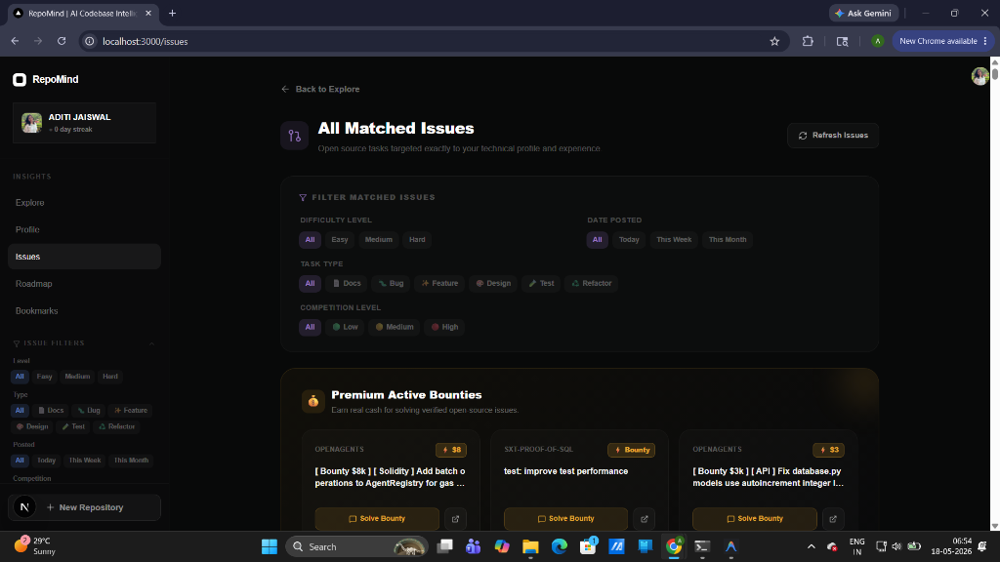
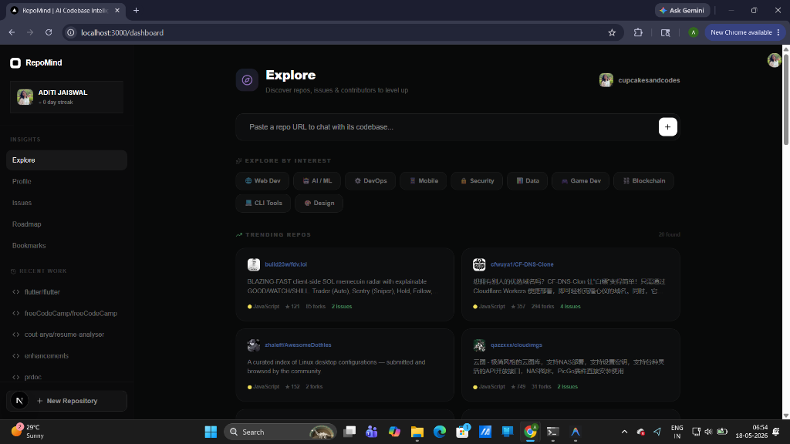

<div align="center">
  
  <h1>RepoMind</h1>
  <p><b>Your open source journey, personalised.</b></p>
  <p>
    RepoMind analyzes your GitHub profile, finds open-source issues perfectly matched to your skill level, and builds a day-by-day roadmap to get your first PR merged — and land your first job offer.
  </p>
  <br/>
  
</div>

<br/>

## 🚀 Overview

Open source can be incredibly intimidating. Figuring out *what* to work on and *where* to start stops most developers before they even write a single line of code.

**RepoMind** is the intelligence layer for your open-source career. By deeply analyzing your past contributions, your language proficiency, and complex project codebases, RepoMind curates the perfect entry points into major open-source projects.

## ✨ Core Features

<details open>
<summary><b>🎯 AI-Driven Roadmaps & Personalized Dashboard</b></summary>
<br/>

We generate highly personalized, leveled contribution paths based on your current expertise. We gamify your journey from your first "Good First Issue" to maintainer status.
</details>

<details open>
<summary><b>💬 Intelligent Contextual Chat</b></summary>
<br/>

Stop blindly searching through massive repositories. Ask architectural questions using natural language, and our RAG pipeline fetches the exact code, issues, and PR context you need to understand the codebase instantly.
</details>

<details open>
<summary><b>🔍 Advanced Issue Discovery</b></summary>
<br/>

Filter open bounties and issues by difficulty, label, and competition level. RepoMind evaluates issue complexity so you never get overwhelmed.
</details>

<details open>
<summary><b>🧭 Explore Trending Open Source</b></summary>
<br/>

Discover new and trending repositories perfectly matched to your skills, categorised by domain (AI, Web, DevOps).
</details>

- 🏆 **Dynamic Developer Profiles**: Showcase your actual impact. We track your language proficiency, merged PRs, and bounty streaks to build a verifiable, enterprise-grade reputation profile that gets you hired.
- 🔖 **Contextual Bookmarks**: Save complex issues and attach private research notes before starting your work.

## 🛠 Tech Stack

RepoMind is built to scale, utilizing a modern, high-performance web stack:

- **Frontend Framework**: Next.js 14+ (App Router)
- **Language**: TypeScript
- **Styling**: Tailwind CSS & Vanilla CSS modules
- **AI & RAG Pipeline**: LangChain + Google Gemini (Embeddings & LLM)
- **Vector Database**: MongoDB Vector Search
- **Caching & Rate Limiting**: Redis
- **Integrations**: GitHub REST API (Octokit)

## 💻 Running Locally

### Prerequisites
- Node.js (v18+)
- npm, yarn, or pnpm
- MongoDB Atlas (for Vector Search)
- Upstash Redis (or local Redis instance)
- Google Gemini API Key
- GitHub Personal Access Token

### Setup Instructions

1. **Clone the repository:**
   ```bash
   git clone https://github.com/cupcakesandcodes/Repomind.git
   cd Repomind
   ```

2. **Install dependencies:**
   ```bash
   npm install
   ```

3. **Environment Variables:**
   Create a `.env.local` file in the root of the project and add the following keys:
   ```env
   # AI & Embeddings
   GOOGLE_API_KEY=your_gemini_api_key

   # GitHub Integration
   GITHUB_TOKEN=your_github_personal_access_token

   # Vector Database
   MONGODB_URI=your_mongodb_connection_string

   # Caching
   UPSTASH_REDIS_REST_URL=your_redis_url
   UPSTASH_REDIS_REST_TOKEN=your_redis_token
   ```

4. **Start the Development Server:**
   ```bash
   npm run dev
   ```

5. **Open the app:**
   Navigate to [http://localhost:3000](http://localhost:3000) in your browser.

## 🛡 Security & Privacy

RepoMind **does not** permanently store your private source code. Our engine locally batches and processes files, extracting metadata, commit histories, and vector embeddings securely. If you authenticate for private repositories, we only use read-only access scopes.

## 📄 License

© RepoMind Inc. All rights reserved.
