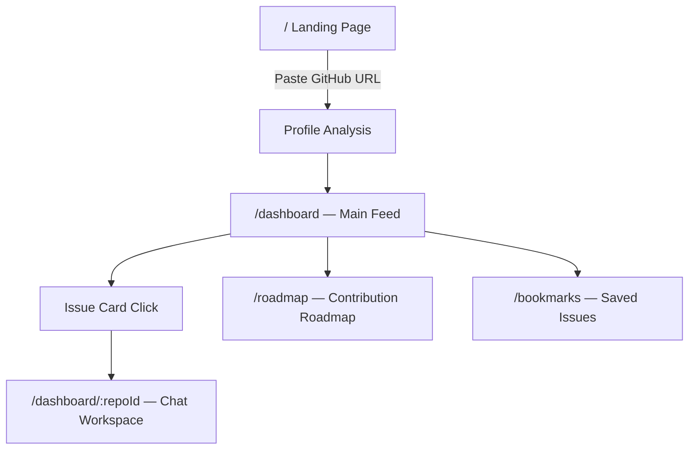

# RepoMind — Feature Architecture & Integration Plan

## Core Design Principle: Progressive Disclosure

> [!IMPORTANT]
> Every feature must earn its screen space. Nothing is shown unless it's contextually relevant. The app should feel like it has 3 features until the user needs the 4th.

---

## Information Architecture

---

## Page-by-Feature Mapping

### 1. Landing Page (`/`)
**Features here:** GitHub Profile Analyzer (input)
- The ONLY thing here is the search bar + value prop
- No feature list, no clutter — just the hook

### 2. Dashboard (`/dashboard`) — The Hub
This is where most features live, but as **layers**, not sections:

| Layer | Feature | How it appears |
|-------|---------|---------------|
| **Top Bar** | Profile summary | Small chip: avatar + "React · TypeScript · 12 repos" |
| **Top Bar** | Streak tracker | Flame icon + "5 day streak" next to profile |
| **Hero Card** | "Perfect for you" daily pick | Single prominent card, refreshes daily |
| **Feed** | Auto repo discovery | The feed IS the discovery — issues from matched repos |
| **Feed** | Issue matchmaking | Each card shows match % badge |
| **Inline badges** | Competition score | 👥 "2 working" (green = low competition) |
| **Inline badges** | Maintainer responsiveness | ⚡ "Merges in 3d avg" or 🐌 "Slow responder" |
| **Inline badges** | Repo momentum | 📈 "Growing" / 📉 "Declining" |
| **Inline badges** | Difficulty | "Easy" / "Medium" / "Hard" color-coded pill |
| **Feed filter** | Difficulty timeline | Toggle: "Show my level" auto-filters by skill |
| **Sidebar** | Bookmarks link | Icon + count |
| **Sidebar** | Roadmap link | Icon + progress ring |

### 3. Chat Workspace (`/dashboard/:repoId`) — Deep Work
| Location | Feature | How it appears |
|----------|---------|---------------|
| **Main area** | On-demand repo chat | The entire page IS the chat |
| **Header button** | PR draft generator | "Generate PR" button → slide-out panel |
| **Header button** | Bookmark + notes | Bookmark icon → inline note input |
| **Right sidebar** | Similar solved issues | Collapsible panel, hidden by default |

### 4. Roadmap Page (`/roadmap`)
| Feature | Implementation |
|---------|---------------|
| Contribution roadmap | 3-step vertical timeline: "Solve these to become core contributor" |
| Difficulty progression | Issues ordered easy → hard within each repo |

### 5. Bookmarks Page (`/bookmarks`)
| Feature | Implementation |
|---------|---------------|
| Saved issues | Simple list with personal notes inline |
| Quick resume | Click → goes straight to chat workspace |

---

## Implementation Phases

### Phase 1: Core Loop (Build Now)
> Get the profile → show matched issues → chat → generate PR

1. **GitHub Profile Analyzer** — API route that reads GitHub profile
2. **Dashboard Feed** — Dynamic issue cards (remove all hardcoded data)
3. **Issue Match Scoring** — Basic match % based on language overlap
4. **Chat Workspace** — Already built, just needs refinement
5. **PR Draft Generator** — Already built as modal

### Phase 2: Intelligence Layer (Build Next)
> Make the matching smart and the metadata rich

6. **Competition Score** — Count open PRs for each issue
7. **Maintainer Responsiveness** — Avg time to merge recent PRs
8. **Repo Momentum Score** — Stars trend + commit frequency
9. **Difficulty Estimation** — Based on file count, complexity signals
10. **Similar Solved Issues** — Vector search across closed PRs

### Phase 3: Engagement & Growth
> Keep users coming back

11. **"Perfect for You" Daily Pick** — Cron job, 1 highlighted issue/day
12. **Streak Tracker** — LocalStorage + optional DB persistence
13. **Contribution Roadmap** — Ordered issue sequence per repo
14. **Bookmarks + Notes** — LocalStorage with sync option
15. **Difficulty Timeline** — Progressive difficulty filter

---

## API Routes Needed

| Route | Purpose | Phase |
|-------|---------|-------|
| `POST /api/analyze-profile` | Parse GitHub profile, extract stack | 1 |
| `GET /api/discover-issues` | Find matching issues across GitHub | 1 |
| `POST /api/match-score` | Calculate user↔issue match % | 1 |
| `GET /api/repo-stats/:owner/:repo` | Competition, momentum, responsiveness | 2 |
| `GET /api/similar-issues/:issueId` | Vector search for similar solved issues | 2 |
| `POST /api/generate-pr` | LLM-powered PR description from chat context | 1 |
| `GET /api/daily-pick` | Today's "perfect for you" issue | 3 |
| `GET /api/roadmap/:repoOwner/:repo` | Ordered issue sequence | 3 |

---

## UI Component Inventory

### New Components Needed:
- `ProfileChip` — Small avatar + stack badges in header
- `StreakBadge` — Flame icon + day count
- `IssueCard` — The main feed card with all inline badges
- `MatchBadge` — "94% match" percentage pill
- `MetaBadge` — Generic badge for competition/momentum/responsiveness
- `DifficultyPill` — Color-coded Easy/Medium/Hard
- `DailyPick` — Hero card for the daily recommendation
- `SimilarIssues` — Collapsible right panel in chat
- `BookmarkButton` — Toggle + note input
- `RoadmapTimeline` — Vertical stepper component

### Existing Components to Modify:
- `Sidebar` — Add profile chip, streak, bookmarks link, roadmap link
- `Dashboard` — Replace hardcoded data with dynamic feed
- `ChatWindow` — Add similar issues panel, bookmark button

---

## Decision Needed

> [!WARNING]  
> **GitHub API Rate Limits**: Unauthenticated requests are limited to 60/hour. For discovering issues across GitHub, we'll need:
> - Option A: GitHub OAuth (user authenticates, gets 5000 req/hour)
> - Option B: Server-side GitHub token (shared, but limited)
> - Option C: Pre-index popular repos and match from cache
> 
> **Recommendation**: Start with Option C (cache popular repos), add OAuth later for personalized discovery.

---

## Shall I begin building Phase 1?
