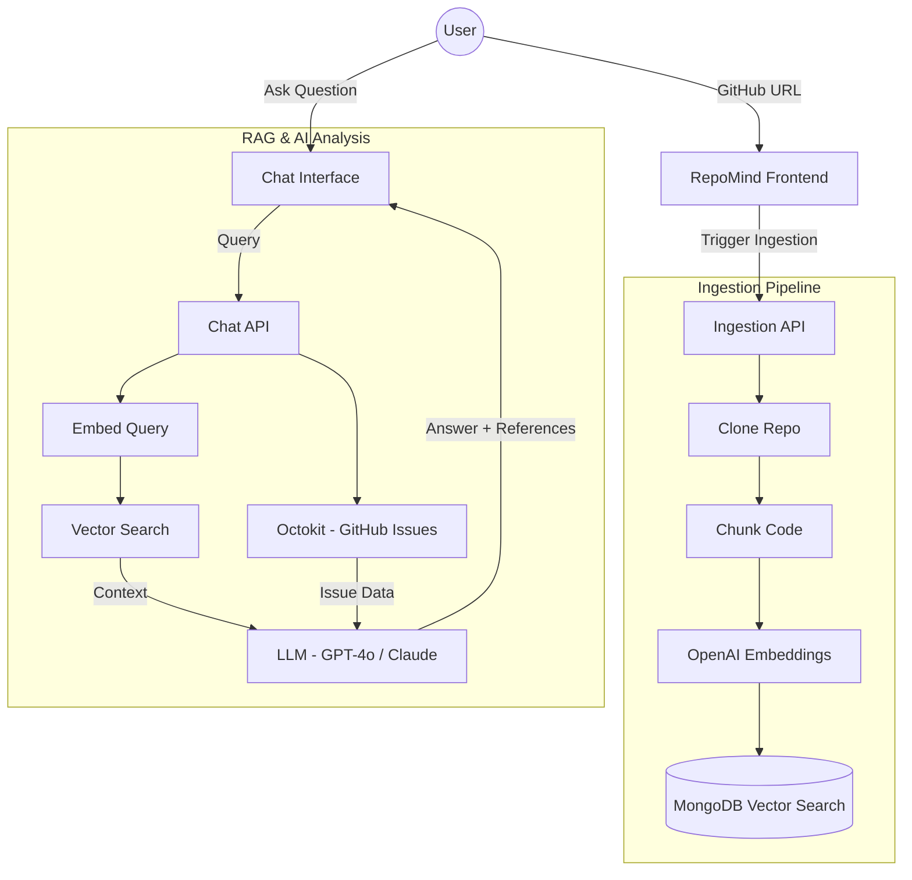

# Implementation Plan - RepoMind: AI Codebase Chat

RepoMind is a premium RAG-based application that allows developers to interact with any GitHub repository through a natural language interface. It clones repositories, indexes them into MongoDB Atlas Vector Search, and provides an intelligent chat interface for deep codebase understanding.

## System Flow

## User Review Required

> [!IMPORTANT]
> **API Keys Needed**: This project requires `OPENAI_API_KEY`, `MONGODB_ATLAS_URI`, and optionally `GITHUB_TOKEN` for private repos.
> **Database Setup**: You will need a MongoDB Atlas cluster with **Vector Search enabled**. I will provide instructions on how to set up the index.

## Proposed Changes

### 1. Foundation & Setup
Set up the Next.js project with a focus on a "Premium Design" system using Vanilla CSS.

#### [NEW] [Project Scaffolding]
- Initialize Next.js in the current directory (`c:\dev\codebase chat`).
- Install dependencies: `langchain`, `@langchain/openai`, `@langchain/mongodb`, `mongodb`, `simple-git`, `lucide-react`, `framer-motion`.

---

### 2. Design System & UI Components
Create a cohesive, high-end visual language.

#### [NEW] [index.css](file:///c:/dev/codebase%20chat/src/app/globals.css)
- Define CSS Variables for the "Obsidian Deep" palette.
- Implement glassmorphism utilities and animated background effects.

#### [NEW] [Layout & Navigation](file:///c:/dev/codebase%20chat/src/app/layout.tsx)
- Set up modern typography (Inter/Outfit).
- Create a persistent sidebar for repository history.

#### [NEW] [Hero Section](file:///c:/dev/codebase%20chat/src/components/Hero.tsx)
- A striking entrance for repository ingestion.

---

### 3. Backend: Ingestion Pipeline
Logic for cloning, chunking, and embedding code.

#### [NEW] [Ingestion API](file:///c:/dev/codebase%20chat/src/app/api/ingest/route.ts)
- **Smart Update Logic**: Check latest GitHub commit SHA vs. stored SHA in DB.
- **Freshness**: If SHA matches, skip indexing. If different, purge old vectors and re-index.
- **Process**: Shallow clone -> Filter (ignore binary/node_modules) -> Chunk -> Embed -> Store SHA.

#### [NEW] [Vector Store Service](file:///c:/dev/codebase%20chat/src/lib/vector-store.ts)
- Centralized logic for connecting to MongoDB.
- Methods for `deleteByRepoId`, `upsertRepoMeta`, and `similaritySearch`.

---

### 4. Frontend: Chat Experience
The core interactive layer.

#### [NEW] [Chat Interface](file:///c:/dev/codebase%20chat/src/components/Chat.tsx)
- Message list with code syntax highlighting.
- Input box with loading states and auto-suggest.

#### [NEW] [Chat API](file:///c:/dev/codebase%20chat/src/app/api/chat/route.ts)
- Retrieval-Augmented Generation (RAG) loop.
- Streaming responses for a "live" feel.

---

### 5. Advanced Features (Phase 1.5)
- **GitHub Issues Integration**: Fetch current issues using Octokit to answer "What are the current issues?".
- **Repo Analysis**: Automatic summary generation (Purpose, Tech Stack, Key Modules).
- **Suggestions Engine**: LLM-driven suggestions for improvements or new features based on codebase analysis.
---

## Scalability & Production Readiness

To handle large repositories and high concurrent usage, we will implement the following strategies:

### 1. Asynchronous Ingestion (Task Queues)
- **Problem**: Large repos cause API timeouts during ingestion.
- **Solution**: Move ingestion to a background worker using **BullMQ (Redis)** or **Upstash QStash**. The API will return a `jobId` immediately, and the frontend will poll for status.

### 2. Distributed Chunking & Embedding
- **Strategy**: Process file batches in parallel to speed up indexing.
- **Optimization**: Use `Promise.all` with a concurrency limit to avoid hitting OpenAI rate limits while maximizing throughput.

### 3. Metadata Filtering in Vector Search
- **Strategy**: Always filter searches by `repository_id` in MongoDB Atlas to keep the search space small and fast, even with millions of vectors from different users.

### 4. Smart Snapshot Indexing (SHA-Based)
- **Strategy**: Avoid re-indexing identical code. Store the latest `commit_sha`.
- **Validation**: On every ingestion request, compare local SHA with GitHub's latest. Only re-clone if changed.
- **Cleanup**: Automatically delete all existing vectors for a `repo_id` before inserting new ones to prevent database bloat.

### 5. Caching & Filtering
- **Strategy**: Use Redis to cache common queries and summaries.
- **Smart Filtering**: Strictly ignore non-code files (images, logs, `.lock` files) to minimize storage and LLM noise.

---

## Verification Plan

### Automated Tests
- Script to verify repository cloning and chunking.
- Integration test for Vector Search retrieval.

### Manual Verification
1. Paste a public repository URL (e.g., `https://github.com/octokit/rest.js`).
2. Verify ingestion progress bar/status.
3. Ask: "How is the request authentication handled in this repo?"
4. Confirm the answer includes file references and accurate code context.
